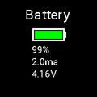
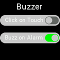
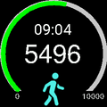
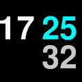
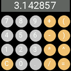
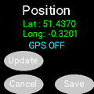
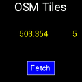
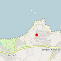
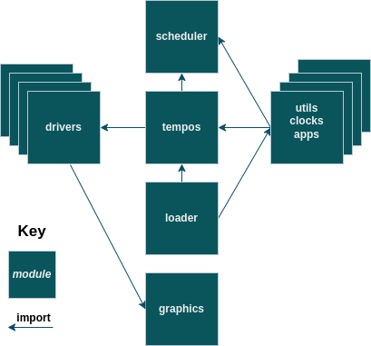

# Micropython T-watch 2020 V1 & V2 & V3

This repository is an implementation entirely in Micropython of a supporting operating system and applications for the Lilygo T-watch 2020. It has been tested for V1 and V2 only, and very recently ported on V3.

Video of watch in operation https://youtu.be/TL3tCaUthRQ

## Application Modules

Applications are simply micropython modules that provide an `app_init()`and an `app_end()` method.

An application module is installed by copying its file into one of three folders on the T-watch. These are as below - each showing screendumps of example applications:


### utils

   

  


### clocks

   

     

### apps

   

### V2 only

   


### Navigation between Application Modules

Application modules in each of the above folders are organised into a ring structure when loaded such that moving between modules is triggered by swiping right or left. On initialisation, the watch runs a module from the `clocks` folder i.e. a clockface. Swiping down moves to a module in the `utils` folder and swiping up to one in the `apps` folder. To summarise, swipe left/right to move between applications in a folder and up/down to move between folders.
 
### Writing an Application Module

Listed below is the micropython module that implements the clock face depicted above - second row, far right.  Application modules are event driven - in this case a periodic event every 1000ms created by the call to the `setInterval` method provided by the scheduling object `sched` imported from the central system `tempos` module. In response to a swipe action, the system invokes the `app_end` function of the current application module and then the `app_init` function of the destination module. Consequently, here, `app_init` draws the clock face and initiates a periodic event to redraw the face every second. `app_end` terminates this event and clears the screen. Graphics operation are provided by the imported graphics instance `g`. 


```
from tempos import g,rtc,sched
from graphics import WHITE,BLACK,CYAN,LIGHTGREY
from fonts import hugefont

def drawtime():
    t = rtc.datetime()
    g.fill(BLACK)
    g.setfont(hugefont)
    g.text("{:02}".format(t[4]),0,45,WHITE)
    g.text("{:02}".format(t[5]),125,45,CYAN)
    g.text("{:02}".format(t[6]),125,130,LIGHTGREY)
    g.show()

def app_init():
    global clock
    drawtime()
    clock = sched.setInterval(1000,drawtime)

def app_end():
    global clock
    sched.clearInterval(clock)
    g.fill(BLACK)

```


## System Modules

The main systems modules are organised as shown below:



### tempos

The central tempos` module instantiates  device drivers:

`pm` - power management (AXP202)

`prtc` - real-time clock (PCF8563), 

`g`   - lcd display (ST7789), 

`ac` - accelerometer (BMA423)
 
`tc`  - touch (FT6236), 

`buzzer` =- (DRV2605 - *V2 only*), 

In addition, this module encapsulates watch settings, manages putting the watch into light sleep and subsequent reawakening via wrist tilt or double tap and creates the scheduling object `sched`.


### scheduler

The 'scheduler' module supports event driven activation of application module functions. 


`Scheduler.setInterval(period,act,arg)`

 Schedules function `act` to be called every `period` milliseconds with parameters `arg`. Returns the identity of the scheduler entry which can be used to cancel using: `Scheduler.clearInterval(e)`.
 
`Scheduler.setTimeout(period,act,arg)`

 Schedules function `act` to be called after `period` milliseconds with parameters `arg`. Returns the identity of the scheduler entry which can be used to cancel using: `Scheduler.clearTimeout(e)`.
 
 
This module also supports an  `Event` class which is used to activate application functions based on touch interrupts etc. The following functions operate on events

 
`Event.signal(arg)`

 Activate all the listeners of this event - passes argument `arg`.
 
 `Event.irq_signal(arg)`
 
 As above but used when event signalled from an interrupt routine.
 
 `Event.addListener(act)`
 
 Adds function`act`as listener. Returns entry id which can be used remove the listener using `Event.removeListener(e)` An example of listening for touch events is shown below:
 
 ```
from tempos import tc
 
def ontouch(tch):
    print("X {} Y {} Gesture {}".format(*tch))
    
tc.addListener(ontouch)
 ```
 
### loader

The T-watch has 4 megabytes of SPIRAM. To exploit this to make the watch responsive to user interaction, the loader loads all application modules when the watch is initialised/powered up. Consequently, loading can take some time particularly if application modules themselves load png images. However, as all application modules are loaded at startup, switching between applications is fast leading to a better user experience. Since we use `lightsleep` which maintains memory the watch need only be re-initialised infrequently. Loading time could be reduced by using frozen bytecode built into the micropython image - however, one of the objectives is to use only a generic build.

*Note: The next step will be to provide an application module manager which allows application modules to be loader from the web while the watch is runnin*g


## Installation


1. From the `firmware`folder install the image `firmware.bin`on the t-watch - to do so you can follow the steps described in the section 'How to firmware flash' below. This image implements GPIO wake up from light sleep and gives access to the full 16M of flash  which the standard generic builds do not.

2. Edit the `config.py` file setting the  version of your T-watch (1, 2 or 3), WIFI network information, open weather map key.

3. Edit `location.json` with your location - used by the weather app.

3. Compile all the micropython file to bytecode by executing `compile.sh` in the `src` directory. You will need to edit this file to point to your local copy of the cross-compiler `mpy-cross`  

4. Copy all the .mpy bytecode and .png imagefile to the T-watch by executing `install.sh` The command file assumes your watch is connected to `/dev/ttyUSB0`. If this is not the case edit the file and remove the u0 parameter which should then let `mpremote` find the port automatically or specify your port explicitly to `mpremote` (see `mpremote help`).  

5. After executing the installation script, the watch should start loading as a `boot.py` file is copied to the T-watch. This contains the line `import loader` which starts the watch software.

If nothing happens on reboot a good first step in debugging is to comment out the line `import loader` in `boot.py` and reset the watch. Then, using `REPL` type `import tempos` which should load all the drivers and - after a delay - display `Loading ...` on the watch screen. 

### Battery life

A recent update  reduces the voltage supply from 3.3V to 2.7V  during sleep, the light sleep current is now measured at:

* V1 = 2.0 ma
* V2 = 1.3 ma

which with light use should give two or three days battery life for V1 watches and three or four days with V2 watches. (The V1 watch has no way to reset the touch driver chip and so it cannot be put into its power saving hibernate mode during light sleep)

### How to firmware flash

### CLI method (esptool)
* *You can read more at [the following adress](https://docs.micropython.org/en/v1.20.0/esp32/tutorial/intro.html#deploying-the-firmware)*
* Install `esptool` with `python -m pip install esptool` (be careful, some other repos have very outdated versions)
* Connect your watch via USB to your computer. Make sure to use a proper wire that allows data and not only a charging cable.
* Find out which port the watch is using (when in doubt, usethe Thonny method)
* `python -m esptool --port /dev/ttyACM0 erase_flash`
* `python -m esptool --port /dev/ttyACM0 --chip esp32 write_flash -z 0x1000 ./firmware/firmware.bin`

### GUI method (Thonny)

* Install the latest **[thonny](https://thonny.org/)**
* Install `esptool` with `python -m pip install esptool` (be careful, some other repos have very outdated versions)
* Likewise install `mpremote` with `python -m pip install mpremote`
* Connect your watch via USB to your computer. Make sure to use a proper wire that allows data and not only a charging cable.
* Open thonny, in the top bar click on `Tools` then `Select interpreter`.
* In the new window, as the two dropdowns menus select the interpreter `MicroPython (ESP32)` and the appropriate USB port. Then instead of clicking on "OK" click on `Install or update firmware`.
* Select the file `firmware.bin` from this repository and the appropriate USB port. As `Flash mode` pick `From image file (keep)`. Tick the box `Erase flash before installing`.
* Click on `Install`.
* To show progress, click on the bottom left status message.
* The whole installation should take on the order of 5 minutes.
